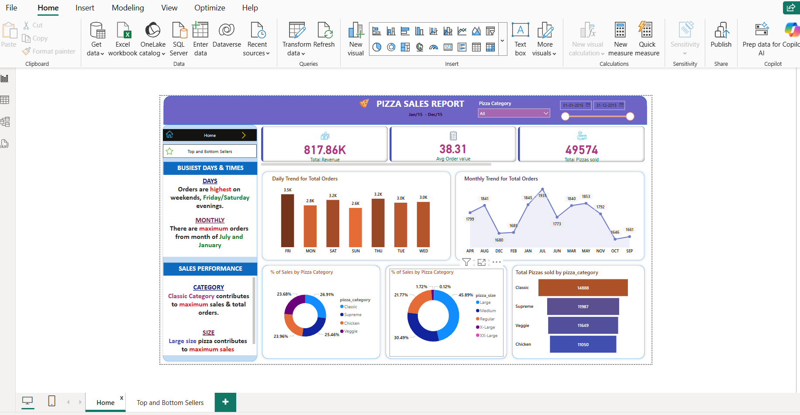
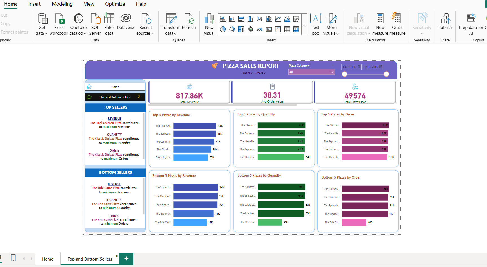

# Pizza Sales Dashboard (Power BI Project)

This Power BI project analyzes pizza sales data to uncover business insights and trends. 
The dashboard provides a clear view of sales performance, top-selling products and bottom selling products to support decision-making in the food industry.
Added Daily and Monthly Trend for Total Orders.

---

##  Key Insights

- 🔹 Monthly and daily sales trends
- 🔹 Revenue distribution by pizza category and size
- 🔹 Top 5 selling names of pizzas
- 🔹 Bottom 5 selling names of pizzas
- 🔹 Best-performing days and hours
- 🔹 Total revenue, quantity sold, and order volume metrics

---

## Files Included

- `Pizza_Sales_Dashboard.pbix` – Main Power BI file

---

##  Tools Used

- Power BI Desktop
- DAX (Data Analysis Expressions)
- Excel (Data preprocessing)

##  Dashboard Previews

###  Overall Sales Dashboard

### Top and bottom Selling Pizzas
